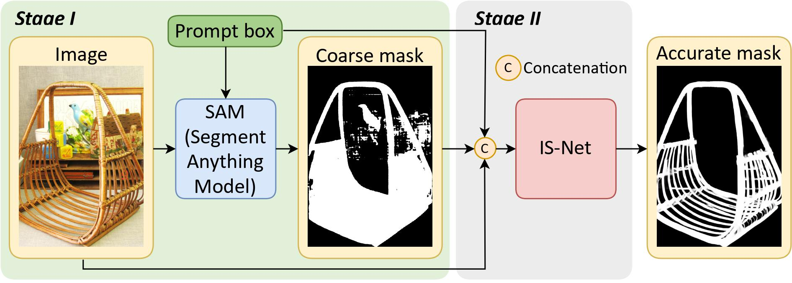
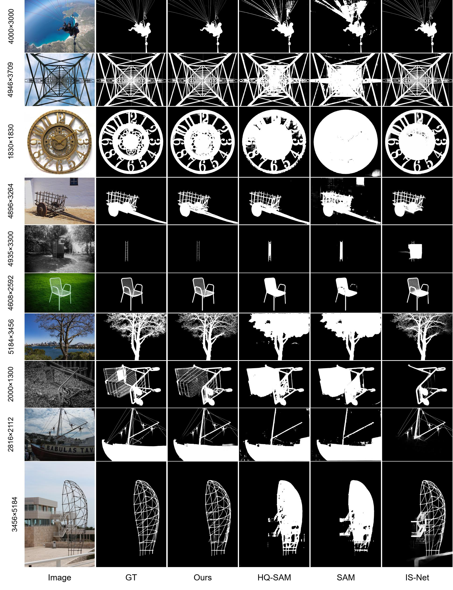

# DIS-SAM

This is the official PyTorch implementation of [DIS-SAM](https://arxiv.org/abs/2401.00248).

> # Promoting Segment Anything Model towards Highly Accurate Dichotomous Image Segmentation
>
> Xianjie Liu, Keren Fu, Qijun Zhao
>
> arXiv:2401.00248

🔥If you are interested in Dichotomous Image Segmentation (DIS), we highly recommend checking out our additional project [Awesome Dichotomous Image Segmentation](https://github.com/Tennine2077/Awesome-Dichotomous-Image-Segmentation/tree/main). This project compiles all significant research and resources related to DIS, providing comprehensive references and inspiration for your research and practice. We hope this resource list will help you better understand and apply DIS techniques, driving more accurate image segmentation tasks.

# Abstract

The Segment Anything Model (SAM) represents a significant breakthrough into foundation models for computer vision, providing a large-scale image segmentation model. However, despite SAM's zero-shot performance, its segmentation masks lack fine-grained details, particularly in accurately delineating object boundaries. We have high expectations regarding whether SAM, as a foundation model, can be improved towards highly accurate object segmentation, which is known as dichotomous image segmentation (DIS). To address this issue, we propose DIS-SAM, which advances SAM towards DIS with extremely accurate details. DIS-SAM is a framework specifically tailored for highly accurate segmentation, maintaining SAM's promptable design. DIS-SAM employs a two-stage approach, integrating SAM with a modified IS-Net dedicated to DIS. Despite its simplicity, DIS-SAM demonstrates significantly enhanced segmentation accuracy compared to SAM and HQ-SAM.



## Installation

```
conda create -n DISSAM python=3.11.4
conda activate DISSAM

pip install -r requirements.txt
```

## Dataset Preparation

Please download the [DIS-5K dataset](https://github.com/xuebinqin/DIS) first and place them in the "**data**" directory. The structure of the "**data**" folder should be as follows:

```
IS-Net
└──DIS5K
    └── DIS-TE1
    ├── DIS-TE2
    ├── DIS-TE3
    ├── DIS-TE4
    ├── DIS-TR
    └── DIS-VD
    	├──im
    	├──gt
    	└──mask #SAM MASK
```

Download [SAM's weights](https://dl.fbaipublicfiles.com/segment_anything/sam_vit_l_0b3195.pth)  into `sam/notebooks` and run `automatic_mask_generator_example.ipynb` to generate SAM masks.

# Training

(a) Open `IS_Net/train_valid_inference_main.py`, set the path of your to-be-inferenced `train_datasets` and `valid_datasets`, e.g., `valid_datasets=[dataset_vd]`
(b) Set the `hypar["mode"]` to `"train"`
(c) Create a new folder `your_model_weights` in the directory `saved_models` and set it as the `hypar["model_path"] ="../saved_models/your_model_weights"` and make sure `hypar["valid_out_dir"]` is set to `""`, otherwise the prediction maps of the validation stage will be saved to that directory, which will slow the training speed down
(d) Run

```
python train_valid_inference_main.py
```

# Test

Set the path of your to-be-inferenced `valid_datasets`, and set the `hypar["mode"]` to `"valid"`. Run

```
python train_valid_inference_main.py
```

# Demo

After the training is complete, you can simply visualize the output of DIS-SAM with `Demo.ipynb`.
If you need the checkpoints and visual results on DIS-5K, click [HERE](https://drive.google.com/drive/folders/1fE_DCGKU3WA-HmZnqRzaazHe44Lx9RP2?usp=sharing).

# Compare

As shown , DIS-SAM is capable of segmenting out more details. Note that IS-Net does not have prompt box or mask input, whereas  DIS-SAM, HQ-SAM, and SAM take the original image and prompt box as inputs. 



## BibTeX

Please consider to cite DIS-SAM if it helps your research.

```
@article{liu2023promoting,
  title={Promoting Segment Anything Model towards Highly Accurate Dichotomous Image Segmentation},
  author={Liu, Xianjie and Fu, Keren and Zhao, Qijun},
  journal={arXiv preprint arXiv:2401.00248},
  year={2023}
}
```

